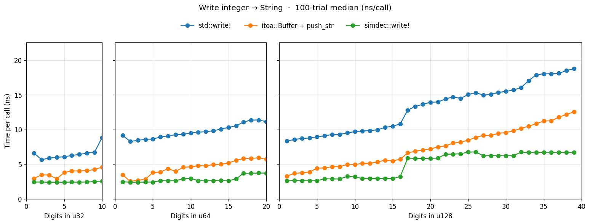
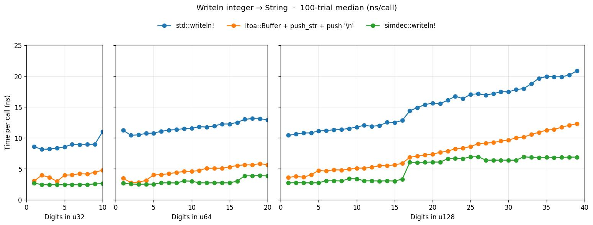

# vitoa

Rust implementation of Champagne Gareau & Lemire, [*"Converting an Integer to a Decimal String in Under Two Nanoseconds"*](https://doi.org/10.1002/spe.70079) (SPE 2026). AVX-512 IFMA SIMD with scalar fallback.

## Examples

```rust
# fn main() -> Result<(), Box<dyn std::error::Error>> {
let mut buf = [0u8; 40];

// Function API — single generic entry point, trait-dispatched per width
let n = vitoa::fmt(1_234_567_890u64, &mut buf)?;  assert_eq!(&buf[..n], b"1234567890");
let n = vitoa::fmt(42u32,            &mut buf)?;  assert_eq!(&buf[..n], b"42");
let n = vitoa::fmt(u128::MAX,        &mut buf)?;  assert_eq!(&buf[..n], b"340282366920938463463374607431768211455");

// `vitoa::fmt<T: Decimal>` — Decimal is sealed and impl'd for u8/u16/u32/u64/u128.
// Other types (e.g. i32, &str) are compile errors, not silent truncation.

// Batch API with dynamic SIMD selector
let values = vec![1u64, 22, 333, 4444];
let mut out = vec![0u8; 80];
let mut offsets = vec![0u32; values.len() + 1];
let total = vitoa::fmt_batch(&values, &mut out, &mut offsets)?;
assert_eq!(&out[..total], b"1223334444");
# Ok(()) }
```

Macros are opt-in via `--features macros` and are drop-in for `core::write!` / `core::writeln!`:

```toml
vitoa = { version = "0.1", features = ["macros"] }
```

```rust,ignore
let mut s = String::new();
vitoa::write!  (&mut s, "{}",   42u64).unwrap();      // "42"
vitoa::writeln!(&mut s, "{}",   u128::MAX).unwrap();   // routes via FastIntArg → no truncation
let mut buf = [0u8; 64];
let len = vitoa::write_joined!(buf, sep = b',', 1u64, 2u64).unwrap();  // "1,2"
```

## How dispatch works

```mermaid
flowchart TD
    A([call site]) --> B{which entry?}
    B -->|"fmt(u64)"| C{value &lt; 10⁸ ?}
    B -->|"fmt_u32"| D{value &lt; 10⁸ ?}
    B -->|"fmt_u128"| E{value &lt; 10¹⁶ ?}
    B -->|"fmt_batch"| F[sample 1% of lengths<br/>build histogram]
    B -->|"write!/writeln! macro"| G{format str = '{}{}…' &amp;<br/>target = String/Vec?}

    C -->|yes| K8[1× IFMA 8-digit kernel<br/>+ VPMOVQB + masked store]
    C -->|no|  K16[2× IFMA 8-digit kernels<br/>+ VPERMT2B + masked store]
    D -->|yes| K8
    D -->|no|  K16
    E -->|yes| FMT[delegate to fmt - u64 path]
    E -->|no|  E2{value &lt; 10³² ?}
    E2 -->|yes| U17[Granlund-Montgomery /1e16<br/>+ fmt(hi) + unmasked 16-byte store]
    E2 -->|no|  U33[two GM /1e16 divides<br/>+ u32_le_1e8 top + 2× unmasked stores]

    F --> F1{dominant length<br/>∈ [17,20] &amp; ρ ≥ 0.95?}
    F1 -->|yes| HOMO[homogeneous unmasked path §5.5]
    F1 -->|no|  HETERO[heterogeneous masked path §5.4]
    HOMO --> K16
    HETERO --> K16

    G -->|yes| FAST[FastIntArg::write_into per arg →<br/>u8/u16/u32/u64 → write_u64_fast<br/>u128 → write_u128_fast]
    G -->|no|  FALLBACK[::core::write!]
    FAST --> FMT
    FAST --> E2

    K8  --> END([n bytes written])
    K16 --> END
    FMT --> END
    U17 --> END
    U33 --> END
    FALLBACK --> END
```

Compile-time `cfg(simd_ifma)` (emitted by `build.rs` when all four AVX-512 features are enabled) selects the SIMD branches; without it everything falls through to a scalar 2-digit-lookup writer. `build.rs` emits a `cargo:warning` on x86_64 builds missing the features so users see exactly what to add to `RUSTFLAGS`.

## Performance

Median of 100 trials on AMD Ryzen 9900X (Zen 5), `-C target-cpu=native`. Three panels per chart cover u32 (1–10 digits), u64 (1–20), u128 (1–39); x-axis scale is shared (10:20:40 width ratio), y-axis is sized to 1.2× max of the data. Target buffers and `itoa::Buffer` are allocated ONCE outside the timed closure; inputs go through `black_box`.

Charts are split by **output target type** so each line is doing the same kind of work:

### Into `String` (heap-growable target, UTF-8 bookkeeping)

`std::write!` / `itoa::Buffer + push_str` / `vitoa::write!`





### Into `&mut [u8]` (caller-held byte buffer, no heap, no UTF-8 bookkeeping)

`itoa::Buffer::format` / `vitoa::fmt` / `vitoa::write_joined!`

![write into &mut [u8]](vitoa-times-write-bytes.jpg)

![comma-join 4 values into &mut [u8]](vitoa-times-csv-bytes.jpg)

Reading guide:
- **Into String**: `vitoa::write!`/`writeln!` write the SIMD masked store directly into the `String`'s spare heap capacity (no intermediate stack scratch, no memcpy step). Flat **~2.6 ns through u64 d=15**, stepping to ~3.7 ns at d=17-20 (the 17-20-digit split path). u128 stays flat ~5 ns. `itoa::Buffer + push_str` grows monotonically with digit count (~2.5 → ~6 ns on u64), `std::write!` is 1.5-3× slower than both.
- **Into `&mut [u8]`**: `vitoa::fmt` and `itoa::Buffer::format` are tied on u32 (both at ~2.5 ns). `vitoa::fmt` opens a gap from u64 d≈9 onward and u128 d≈20 onward thanks to the SIMD 16-digit kernel.
- **CSV (`vitoa::write_joined!`)**: the macro is the dedicated separator-join helper into `&mut [u8]` — it expands inline (no per-call closure, no `String` allocation), so it beats the equivalent `itoa::Buffer + copy` loop substantially.

Regenerate the CSVs the charts are built from:

```sh
RUSTFLAGS='-C target-cpu=native' cargo run --release --example digit_curve --features macros -- 100
.venv/bin/python scripts/plot_times.py /tmp/digit_curve_write_string.csv   vitoa-times-write-string.jpg   "..."
# ...etc for the other 3 CSVs
```

## Requirements

- **x86_64 + AVX-512 F/IFMA/VBMI/BW** (Ice Lake+, Zen 4+) for the SIMD path.
- Any other target compiles via the scalar fallback; only x86_64 gets IFMA.
- Nightly Rust (AVX-512 intrinsics). Tested with `rustc 1.97.0-nightly`.

## Scripts

Wrappers in `scripts/`:

```sh
scripts/test.sh                                 # cargo test --release --features macros
scripts/clippy.sh                               # clippy on all targets
scripts/kani.sh                                 # cargo kani --features macros
scripts/wasm.sh                                 # cross-build for wasm32
scripts/verify.sh                               # full CI: fmt + test + clippy + wasm + kani
scripts/setup_venv.sh                           # bootstrap .venv (matplotlib + pandas) via uv
scripts/charts.sh [TRIALS]                      # bench + render the 4 perf JPGs (default 100 trials)
```

## Verification

- 27 unit + 12 doctests (`cargo test --features macros`) including exhaustive u8 and u16, and 1 M-sample LCG sweeps for u32/u64/u128 confirming `vitoa::write!` produces byte-identical output to `core::write!` over the full range.
- 4 Kani harnesses (`cargo kani --features macros`) prove the scalar reference path exhaustively over u8, u16, and the digit-count primitive over u64; plus a byte-range invariant on u64. The SIMD kernels are differentially tested against the Kani-proven scalar path.
- Clippy denies (`unwrap_used`, `expect_used`, `panic`, `indexing_slicing`, `unreachable`, `todo`, `unimplemented`) enforced on the library via `Cargo.toml [lints.clippy]`; tests are exempt.

## Roadmap

- ARM NEON / SVE2 backend (paper §7 identifies SVE as a natural extension).
- i64 / i128 signed support.
- `vitoa::Buffer` API à la `itoa::Buffer` so u32 hot loops can skip the caller-buffer memcpy.

## Citation

```bibtex
@article{champagne_gareau_lemire_2026,
  author  = {Champagne Gareau, Ja\"{e}l and Lemire, Daniel},
  title   = {Converting an Integer to a Decimal String in Under Two Nanoseconds},
  journal = {Software: Practice and Experience},
  year    = {2026},
  doi     = {10.1002/spe.70079}
}
```

Paper: [doi:10.1002/spe.70079](https://doi.org/10.1002/spe.70079) · preprint: [arXiv:2604.26019](https://arxiv.org/abs/2604.26019) · reference C++ impl: [github.com/fastfloat/int_serialization_benchmark](https://github.com/fastfloat/int_serialization_benchmark).

## License

MIT or Apache-2.0 at your option.
